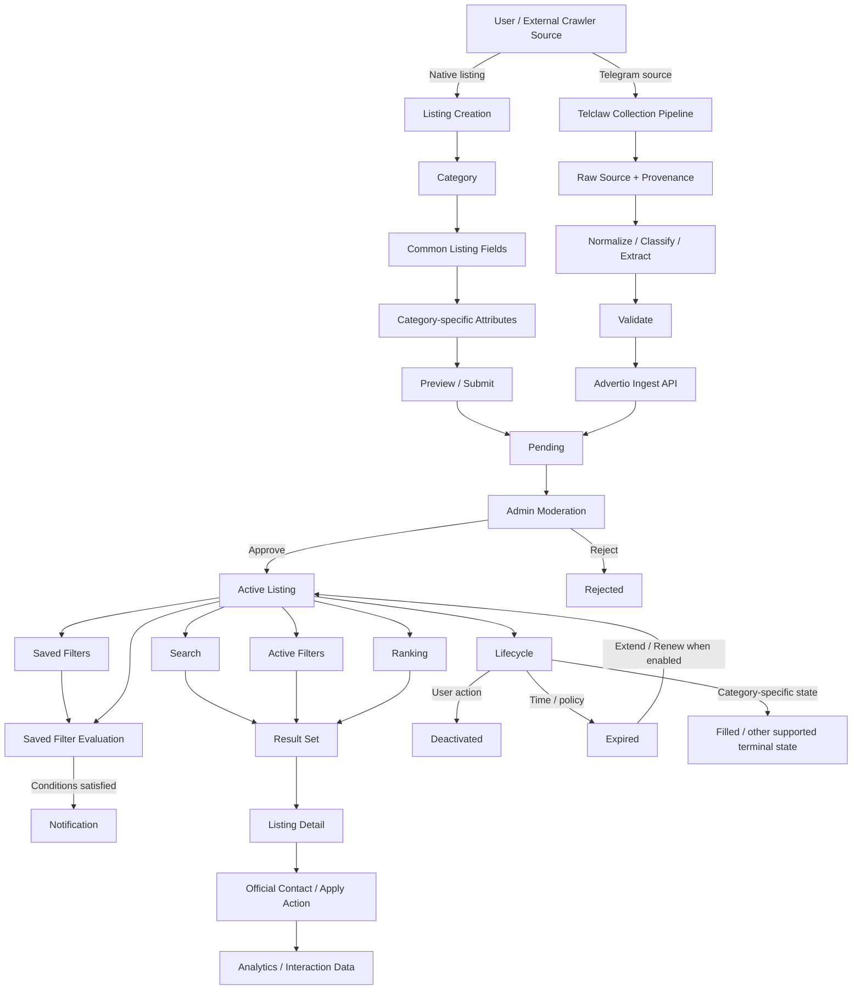
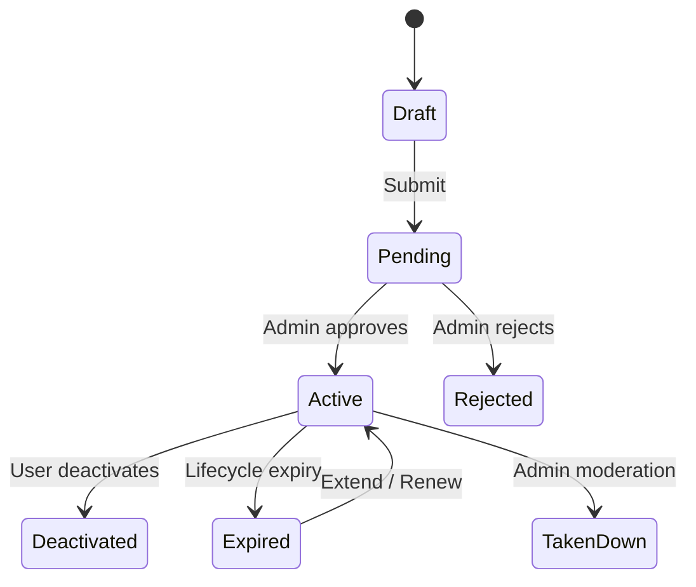
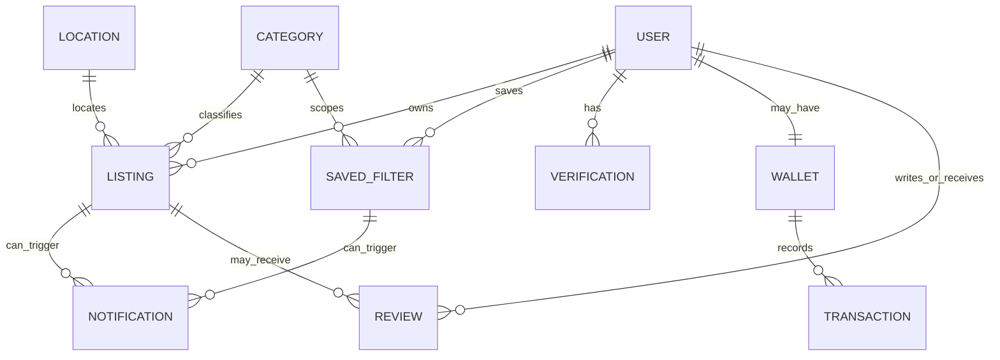
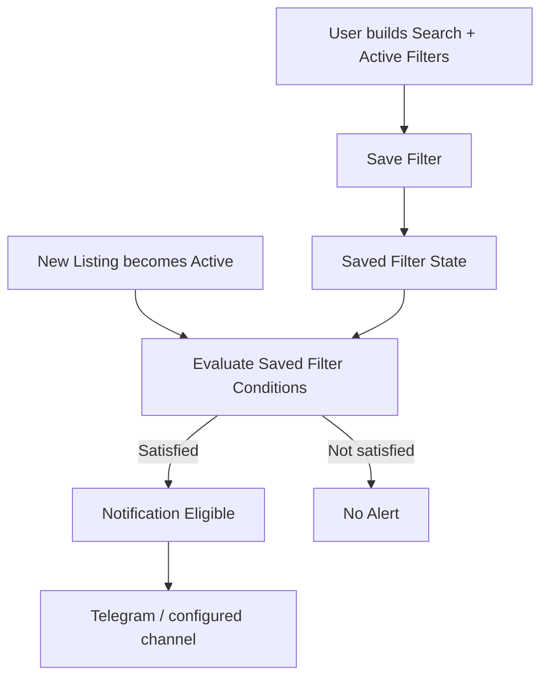

# Advertio Data Model Workflow — Current Documented State

> Status: **Current architecture/workflow reference**
>
> Last aligned with repository documentation on **3 Oct 2026**.
>
> This file describes how the currently documented Advertio product model fits together across native listings, crawler supply, moderation, discovery, contact, Saved Filters, notifications, lifecycle and category-specific attributes.
>
> It intentionally distinguishes:
>
> - **Current verified product behavior**
> - **Current documented product rules**
> - **Development specifications that are not yet verified as live**
>
> This is a workflow/data-contract reference, not proof that every documented target-state capability is already running in production.

---

## 1. System-level workflow



## 2. Core discovery rule

Advertio discovery is based on:

```text
Search
+ Active Filters
+ Saved Filters
+ Ranking
```

### Search

Handles free-text intent.

Examples:

- `Toronto room`
- `warehouse job`
- `Toronto Tehran cargo`
- `tennis North York`

### Active Filters

Apply structured category-specific constraints.

Examples:

- City
- Listing Type
- Price
- Job Category
- Employment Type
- Cargo route/date
- Human Connections activity/date/location

Independent hard filter dimensions generally combine using:

```text
AND
```

Multi-select behavior is defined by each filter.

### Saved Filters

Persist a structured Search/Filter state.

A new Active Listing becomes notification-eligible when it satisfies the Saved Filter conditions.

### Ranking

Orders the already-eligible result set.

Ranking must not silently bypass an active hard Filter.

---

## 3. No category-level matching layer

The Data Model does not require a separate listing-to-listing or person-to-person matching entity.

There is no canonical Data Model entity for:

- Match
- Compatibility Score
- Match Percentage
- Matching Pair
- Matching Recommendation

Category discovery should be implemented through category attributes, Search and Active Filters.

This applies across:

- Housing
- Jobs
- Cargo
- Human Connections
- Services
- Social & Events

If a future recommendation feature is introduced, it must remain separate from the canonical filter eligibility model and should not change structured filter truth.

---

## 4. Native Listing workflow



### Current documented submission flow

```text
Choose Category
→ Eligibility check
→ Title
→ Description
→ Images
→ Location
→ Category-specific Attributes
→ Preview
→ Confirm
→ Pending
→ Admin Moderation
→ Approve / Reject
→ Active / Published
```

### Important status ambiguity

Current source documentation uses both:

```text
Approved
Published
```

after moderation.

The repository does not yet define whether:

- `Approved` is a moderation state and `Published` is a separate publication state; or
- the two words refer to the same operational state.

Data implementation should not invent a distinction until this is explicitly resolved.

---

## 5. Crawler Listing workflow

Crawler supply is separate from native User supply.

```mermaid
flowchart LR
    T[Telegram]
    T --> A[Collection]
    A --> B[Raw Storage]
    B --> C[Cleaning / Normalization]
    C --> D[Category Classification]
    D --> E[Category-specific Extraction]
    E --> F[Validation]
    F --> G[Business Rules]
    G --> H[Advertio Ingest API]
    H --> I[Pending Review / Active]
    I --> J[Normal Listing Discovery]
```



### Required crawler identity

Crawler ingest uses stable source identity:

```text
(sourceName, externalId)
```

where `externalId` is the stable source message identity.

Text/content hash is not the canonical Advertio external identity.

### Crawled Listing rules

Crawled listings must remain distinguishable from native listings.

Recommended canonical supply field:

```text
supply_source:
- native
- crawled
```

Crawler records preserve:

- source name
- external ID
- source URL
- original raw text
- source sender/channel metadata where available
- import timestamp
- normalized/extracted category attributes

### Safe crawler publication default

New crawler sources should default to review:

```text
autoPublish = false
```

Expected ingest behavior can include:

- `PendingReview`
- `Active` when explicitly auto-published
- `alreadyExisted=true` for idempotent success
- permanent validation failure
- retryable transient failure

### Stale source deletion

If the original source post disappears, the corresponding crawled listing should be deactivated through the crawler ingest contract.

The crawler is responsible for both:

```text
create/update supply
+
remove stale supply
```

---

## 6. Main entities and relationships

The detailed files under `11-data-model/` are currently placeholders and should eventually define these entities formally.

The currently documented conceptual relationships are:



### User

Conceptually owns:

- profile
- native listings
- Saved Filters
- verification states
- Wallet/Coin balance where enabled
- reviews/history where enabled

### Listing

Core cross-category entity.

Common data includes:

- identity
- owner/provenance
- category
- title
- description
- media
- location
- category-specific attributes
- status
- timestamps
- supply source
- moderation state
- lifecycle state
- promotion state
- interaction metrics

### Category

Defines:

- canonical category identity
- valid category-specific attributes
- filters
- validation rules
- display behavior
- lifecycle exceptions where required

### Location

Shared canonical geography should be reused across categories.

Examples:

- Country
- Province / State
- City
- Area / Neighborhood

Cargo additionally uses directional origin/destination location pairs.

### Saved Filter

Stores:

- owner User
- Category
- optional search query
- structured Active Filter state
- notification enabled/disabled state
- notification channel/cadence when supported

### Notification

Can originate from:

- Saved Filter eligibility
- listing lifecycle
- admin message
- Wallet state
- listing performance reporting
- contact/payment workflow

### Verification

Belongs to the User or, where explicitly designed, to a specific contextual object such as Cargo trip/ticket verification.

User-authored input must never directly set a verified state.

### Wallet / Transaction

Supports Coin-based product actions where enabled.

All service pricing is documented as Admin-configurable.

---

## 7. Category model — current repository state

| Category | Repository product status | Current verified UI status | Data model direction |
| --- | --- | --- | --- |
| Housing | Most mature category specification | Live/verified in Mini App | Structured Housing attributes + Active Filters |
| Jobs | Development-ready specification | Mini App: Coming Soon; Telegram category visible | Structured Jobs schema + Active Filters |
| Cargo | Development specification | Current UI still contains older Passenger Cargo / Transport wording in some surfaces | One unified Cargo schema; no role split |
| Human Connections | Development specification | Not verified as live | Structured activity/location/date attributes + Active Filters |
| Services | Planned / incomplete category docs | Telegram category visible | Needs category-specific data contract |
| Social & Events | Planned / incomplete category docs | Telegram category visible | Needs category-specific data contract |

### Current UI vs target taxonomy

Some Current State UI labels still lag behind the latest product taxonomy.

Examples:

- Telegram Bot currently documents `Passenger Cargo`
- Mini App currently documents `Transport` as Coming Soon
- Product/category specification now uses `Cargo`

Current-state UI documentation must not be rewritten as if runtime copy has already changed.

---

## 8. Housing workflow — current verified category

Housing is the currently verified live Mini App category.

Current documented discovery includes:

```text
Housing Feed
→ Active Housing Filters
→ Result Count
→ Listing Cards
→ Listing Detail
```

Current Housing filter dimensions include documented fields such as:

- City
- Listing Type
- Property Type
- Bedrooms
- Monthly Rent
- Furnishing
- Gender Preference
- Rental Duration
- More Filters
- roommate-oriented criteria
- amenities and other structured fields

Housing is the current best reference implementation for:

```text
Category Attributes
→ Active Filters
→ Result Set
```

---

## 9. Jobs workflow — development state

Jobs target flow:

```text
Employer/Recruiter
→ Jobs Listing
→ Structured Job Attributes
→ Pending
→ Admin Review
→ Active
→ Search + Active Filters
→ Job Detail
→ Apply / Contact
→ Filled / Deactivated / Expired
```

Jobs introduces category-specific lifecycle/data concepts such as:

- Job Category
- Employment Type
- Work Arrangement
- Company
- Salary
- Application Method
- `Filled` state

The repository explicitly identifies a conflict with the generic one-active-listing-per-category rule because a legitimate employer may need multiple active Jobs.

That conflict must be resolved before Jobs production launch.

---

## 10. Cargo workflow — development state

Cargo uses a single unified listing model.

```text
Cargo Listing
→ Route
→ Date / Time
→ Airline / Flight
→ Cargo Type
→ Weight / Unit
→ Quantity / Volume
→ Price / Currency
→ Description / Contact
→ Pending
→ Admin Review
→ Active
→ Search + Active Filters
```

Cargo has:

- no Carrier/Sender Product role
- no Passenger Cargo subcategory
- no Ride Sharing subcategory
- no Logistics/Shipping subcategory

Telclaw `transferlist` data can feed the same Cargo listing schema.

Useful crawler attributes include:

- origin/destination city/province/country
- airline
- flight number
- departure/arrival date/time
- cargo type
- weight + unit
- quantity
- volume + unit
- price + currency
- contact
- features

---

## 11. Human Connections workflow — development state

```text
Human Connections Listing
→ Connection Type
→ Activity
→ In-person / Remote
→ Location when applicable
→ Date / Date Range
→ Availability
→ Description
→ Pending
→ Admin Review
→ Active
→ Search + Active Filters
```

The category is designed around structured discovery.

Typical filters:

- Connection Type
- Activity
- Location / Remote
- Date
- Availability
- optional language/group-size/trust filters

Saved Filters can later notify the User when a new Active Listing satisfies the same filter conditions.

---

## 12. Saved Filter workflow



### Saved Filter invariant

A notification must reflect the saved structured conditions.

The system should not silently loosen hard filter constraints to manufacture alerts.

---

## 13. Contact / interaction workflow

```text
Active Listing
→ Listing Detail
→ Official Contact / Apply action
→ Contact routing
→ Interaction analytics
```

Official actions are important because they provide measurable conversion signals.

Depending on listing type/source:

- native contact can follow normal Advertio contact-access rules;
- crawled listing contact can route to Telegram/source contact;
- Jobs can later support external URL/email application;
- crawler monetization remains disabled under current crawler rules.

---

## 14. Lifecycle and monetization boundary

The repository contains unresolved lifecycle/monetization conflicts.

### Early Access conflict

Two opposite models exist:

#### Model A

```text
fresh listing
→ paid/coin contact early
→ free later
```

#### Model B

```text
free first
→ paid/coin contact later
```

The Data Model workflow must not hard-code either model as canonical until Product resolves it.

### Expiry conflict

Documentation references both:

- Day 30
- Day 31

as expiry boundaries.

### Extension

The source includes category-specific example Coin prices, but pricing is Admin-configurable.

The canonical model should therefore represent:

```text
service type
+ configured price
+ transaction
```

rather than embedding sample prices into entity schemas.

---

## 15. One-active-listing rule boundary

Generic product source says:

```text
one Active Listing per User per Category
```

But current category specifications identify exceptions/pressure points:

### Jobs

Employers may legitimately need multiple simultaneous active jobs.

### Cargo

Users may legitimately have multiple routes/dates.

Therefore, Data Model implementation should not enforce one universal database uniqueness constraint such as:

```text
UNIQUE(user_id, category_id, status=active)
```

without category-aware policy.

Recommended architecture:

```text
Category Policy
→ validates active-listing limit
```

rather than a single global hard constraint.

---

## 16. Current verified surfaces

### Mini App

Current documented/verified areas:

- Home navigation
- Global Search
- Housing feed
- Housing filters
- Wallet / Telegram Stars flow
- Profile / My Listings / Saved Listings

Current Home:

- Housing available
- Transport Coming Soon
- Jobs Coming Soon

### Telegram Bot

Current documented category selection:

- Housing & Roommate
- Passenger Cargo
- Jobs
- Services
- Social & Events

The current bot Search Listings and Saved Searches user flows remain Not Verified in the current-state documentation.

### Backoffice / Admin

Current documentation confirms multiple Backoffice capabilities around:

- listing moderation
- users
- channels
- duplicate review
- operational reporting

The canonical Listing workflow assumes Admin moderation because current product rules require approval before publication.

---

## 17. Data Model files that still need formal schemas

At the time this workflow was added, the following files under `11-data-model/` are still empty placeholders:

- `user.md`
- `listing.md`
- `category.md`
- `location.md`
- `saved-search.md`
- `notification.md`
- `review.md`
- `verification.md`
- `wallet.md`
- `transaction.md`

This workflow should be used as a coordination map while those entity contracts are filled.

Recommended implementation order:

```text
1. listing.md
2. category.md
3. location.md
4. user.md
5. saved-search.md
6. notification.md
7. verification.md
8. wallet.md
9. transaction.md
10. review.md
```

because Listing + Category + Location are the central dependencies for the current marketplace workflow.

---

## 18. Key invariants

1. **Every public Listing has one canonical Category.**
2. **Native and crawled supply are distinguishable.**
3. **Category-specific attributes remain structured where used by Filters.**
4. **Active Filters determine structured eligibility.**
5. **Ranking cannot bypass a hard Active Filter.**
6. **Saved Filter alerts use the same canonical filter semantics.**
7. **Crawler source identity is stable and idempotent.**
8. **Unknown crawler data is never fabricated.**
9. **Admin moderation remains in the publication workflow unless a source/policy explicitly allows auto-publish.**
10. **Verification state is system-controlled.**
11. **Current UI labels and target taxonomy must not be conflated.**
12. **Lifecycle conflicts remain explicit until Product resolves them.**
13. **Category-aware active-listing limits are preferable to one universal database constraint.**

---

## 19. Recommended next Data Model work

The next useful step is to turn this workflow into concrete entity contracts.

### First

`listing.md`

Define:

- Listing identity
- owner/provenance
- category
- common fields
- attributes payload/schema strategy
- status
- moderation
- timestamps
- source
- lifecycle
- interaction metrics

### Second

`category.md`

Define:

- canonical category keys
- category schema reference
- filters
- validation policy
- active-listing limit policy
- monetization policy flags

### Third

`location.md`

Define:

- country
- province/state
- city
- area
- canonical IDs/slugs
- Cargo origin/destination reuse

These three entities provide the foundation for Housing, Jobs, Cargo and Human Connections without duplicating core data structures.

---

## 20. Related documentation

- [Product Overview](../03-product/product-overview.md)
- [Product Rules](../03-product/product-rules.md)
- [Listing Lifecycle](../03-product/listing-lifecycle.md)
- [Saved Search / Saved Filter](../03-product/saved-search.md)
- [Housing](../04-categories/housing/overview.md)
- [Jobs](../04-categories/jobs/overview.md)
- [Cargo](../04-categories/cargo/overview.md)
- [Human Connections](../04-categories/human-connections/overview.md)
- [Crawler Overview](../09-crawler/overview.md)
- [Crawler Lifecycle](../09-crawler/lifecycle.md)
- [Mini App Current State](../docs/mini-app/overview.md)
- [Telegram Bot Current State](../docs/telegram-bot/overview.md)
